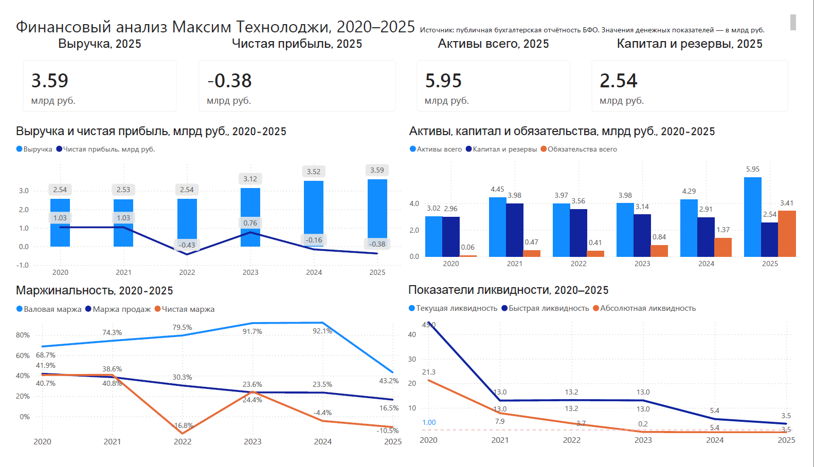

# Финансовый анализ Максим Технолоджи, 2020–2025

## Описание проекта

Проект посвящён финансовому анализу компании **«Максим Технолоджи»** за 2020–2025 годы на основе публичной бухгалтерской отчётности.

Цель проекта — собрать данные из бухгалтерской отчётности, очистить их, привести к единой структуре, рассчитать финансовые показатели и построить dashboard для оценки динамики выручки, прибыли, активов, капитала, обязательств, маржинальности и ликвидности.

## Dashboard



## Основные вопросы анализа

В проекте рассматривались следующие вопросы:

* как изменилась выручка компании за 2020–2025 годы;
* как менялась чистая прибыль;
* росли ли активы компании;
* как изменилась структура капитала и обязательств;
* сохраняет ли компания достаточный уровень ликвидности;
* ухудшилась или улучшилась маржинальность бизнеса;
* какие финансовые риски видны по данным отчётности.

## Источник данных

Источник данных — публичная бухгалтерская отчётность компании за 2020–2025 годы.

В анализ были включены две основные формы:

* бухгалтерский баланс;
* отчёт о финансовых результатах.

Денежные показатели в исходной отчётности представлены в тысячах рублей. Для dashboard значения были переведены в миллиарды рублей.

## Инструменты

В проекте использовались:

* **Excel** — хранение данных, расчётная модель, аналитическая витрина;
* **Power Query** — очистка и преобразование исходных файлов;
* **Power BI** — построение dashboard;
* **финансовый анализ** — расчёт показателей рентабельности, ликвидности, структуры капитала и динамики.

## Workflow проекта

Общий процесс работы:

1. Сбор исходных файлов бухгалтерской отчётности.
2. Загрузка данных в Excel через Power Query.
3. Очистка данных: удаление лишних строк, обработка пустых значений, приведение типов данных.
4. Приведение отчётности к единому long format.
5. Объединение бухгалтерского баланса и отчёта о финансовых результатах в единую таблицу.
6. Создание аналитической витрины по годам.
7. Расчёт финансовых показателей.
8. Построение dashboard в Power BI.
9. Формулирование выводов по финансовому состоянию компании.

## Структура данных

После очистки была сформирована единая таблица `Financial`.

Структура таблицы:

| Поле        | Описание                                              |
| ----------- | ----------------------------------------------------- |
| `line_name` | название строки отчётности                            |
| `line_code` | код строки отчётности                                 |
| `year`      | отчётный год                                          |
| `value`     | значение показателя                                   |
| `statement` | тип отчёта: баланс или отчёт о финансовых результатах |

На основе этой таблицы была создана аналитическая витрина `analytics_mart`, где одна строка соответствует одному году.

## Рассчитанные показатели

В проекте были рассчитаны следующие группы показателей:

### Динамика

* выручка;
* чистая прибыль;
* активы всего;
* капитал и резервы;
* обязательства всего.

### Маржинальность

* валовая маржа;
* маржа продаж;
* чистая маржа.

### Ликвидность

* коэффициент текущей ликвидности;
* коэффициент быстрой ликвидности;
* коэффициент абсолютной ликвидности.

### Структура баланса

* активы всего;
* капитал и резервы;
* обязательства всего.

## Методология

Расчёт показателей основан на классическом подходе к анализу бухгалтерской отчётности.

Использовались стандартные группы финансовых показателей:

* показатели динамики;
* показатели прибыльности;
* показатели ликвидности;
* показатели структуры капитала и обязательств.

Формулы и пояснения к показателям вынесены в отдельный файл:

[Методология расчётов](docs/methodology.md)

## Основные выводы

По результатам анализа можно выделить несколько ключевых наблюдений:

1. **Выручка выросла** с 2,54 млрд руб. в 2020 году до 3,59 млрд руб. в 2025 году.
2. **Чистая прибыль ухудшилась**: в 2025 году компания получила чистый убыток около -0,38 млрд руб.
3. **Активы увеличились** до 5,95 млрд руб. в 2025 году.
4. **Капитал и резервы снизились** относительно пиковых значений прошлых лет.
5. **Обязательства существенно выросли** в 2024–2025 годах.
6. **Показатели ликвидности остаются выше 1,0**, однако имеют нисходящую динамику.
7. **Маржинальность ухудшилась**, особенно в 2025 году: чистая маржа стала отрицательной.

## Интерпретация

Компания показывает рост выручки и активов, однако ухудшение чистой прибыли и снижение маржинальности указывают на ухудшение качества финансового результата. Рост обязательств в 2024–2025 годах требует дополнительного внимания, несмотря на сохранение высокого уровня ликвидности.

Отдельного анализа требуют:

* рост себестоимости;
* динамика прочих расходов;
* изменение структуры обязательств;
* причины отрицательной чистой прибыли в 2025 году.

## Структура репозитория

```text
financial-analysis-maxim-technology/
│
├── README.md
├── data/
│   └── financial_model.xlsx
│
├── power_bi/
│   └── dashboard.pbix
│
├── images/
│   └── dashboard_preview.png
│
└── docs/
    └── methodology.md
```

## Файлы проекта

| Файл                           | Описание                                                                           |
| ------------------------------ | ---------------------------------------------------------------------------------- |
| `data/financial_model.xlsx`    | Excel-файл с очищенными данными, аналитической витриной и справочником показателей |
| `power_bi/dashboard.pbix`      | Power BI dashboard                                                                 |
| `images/dashboard_preview.png` | Скриншот dashboard                                                                 |
| `docs/methodology.md`          | Методология расчёта финансовых показателей                                         |

## Навыки, показанные в проекте

Проект демонстрирует следующие навыки:

* очистка данных в Power Query;
* работа с нестандартной структурой Excel-файлов;
* приведение отчётности к единой аналитической структуре;
* построение аналитической витрины;
* расчёт финансовых коэффициентов;
* построение dashboard в Power BI;
* интерпретация финансовых показателей;
* оформление аналитического проекта для GitHub.

## Ограничения анализа

Анализ основан только на данных публичной бухгалтерской отчётности. В проекте не учитывались управленческие данные, детализация по продуктам, клиентам, регионам, денежным потокам и внутренним операционным метрикам компании.

Поэтому выводы следует рассматривать как финансовую диагностику на основе доступной отчётности, а не как полную оценку бизнеса.
